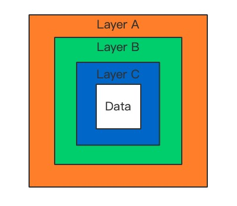

# A Breif Introduction of Tor
## Background
The Tor Project, Inc, became a 501(c)3 nonprofit in 2006, but the idea of "onion routing" began in the mid 1990s.

Labeled as "Dark Web Entrance", "Using by the National Security Agency", "Having relays all over the world", "Open Anonymous Network", and "Most Advanced Means of Obfuscation“

Tor has become the world's strongest tool for privacy and freedom online.

![introduction][introduction-image]
## The Communication Process of Tor
In most cases, the remote servers will know our IP address when we establish a connection with them. It causes leakage of user's geographical location information.

Tor is the acronym of “the Onion Router”. Through Tor, users can communicate anonymously on the Internet.

In fact, Tor is a special kind of proxy which passes users traffic through at least three proxy nodes. And the proxy nodes changes periodically.
### The Process of Creating Tor Circuits
As shown in the picture. In order to access Bob's server anonymously, at first, Alice will randomly select three nodes in the Tor network according to the information from the Directory Servers. Directory Servers are trusted nodes which provide signed directories describing known nodes and their current state.

And through this random 3-relay nodes, Alice can send message to Bob without leak IP address. Because none of the relay node and Bob know the entire circuit. Furthermore, the circuit is temporary and will be rebuilt periodically.

### Encryption Methods
Without encryption, malicious relay node can learn the content and know the whole circuit information. 

Tor uses an incremental path-building method, where the initiator(Alice) negotiates session keys with each relay node in the circuit. 

In order to access Bob, Alice and Node A firstly negotiate a share key KEY_A using the Curve25519 elliptic curve which is a way to negotiate symmetric key on unsafe connection. For the details, Alice and Node A respectively generate private key and public key, and then exchange the public key and combine it with their own private key to get KEY_A. The share key KEY_A is then used to encrypt message between Alice and node A.

Secondly, Alice use KEY_A to encrypt the IP address of node B and the public key for creating shared key with node B then sends them to node A. After decryption, node A sends Alice's public key to node B. Then node B generates its own private key and public key and combine its private key and Alice's public key to get the share key KEY_B. After that, node B send its own public key to node A. A sends it back to Alice after using KEY_A to encrypt so Alice also get the KEY_B.Thirdly, Alice negotiates KEY_C with node C in the same way. Finally, Alice have three share key KEY_A, KEY_B and KEY_C.

With three keys, Alice can begin actual anonymous connection with Bob. Before Alice sends Data to Bob, she uses KEY_C, KEY_B, and KEY_A to encrypt the data in turn, just like the mutiple layers of data and then sends them to node A. Node A strips off A layer with KEY_A and sends it to Node B. Node B strips off B layer with KEY_B and sends it to Node C. Node C finishs the last layer and gets the plaintext then sends it to Bob.

![circuit][circuit-image]

	

###The Launch and Access of Onion Services###
In the case above, only one side of the communication is annoymous, Alice. So how do the services on the dark web be annoymous?

Tor allows clients and relays to offer onion services. It means you can offer a server without revealing your IP address to the users.

There are four steps for creating the link between users and onion servers.

Step one: Onion Servers pick up several relay nodes as the Introduction Points and create Tor circuit with them. Then combine the information of Introduction Points and onion server's public key as descripter and publish it on the directory server through Tor circuit.

Step two: The user downloads the descripter of the onion server which he want to access from directory server through Tor circuit.

Step three: Firstly, the user randomly selects a relay node as the Rendezvous Point and build a Tor circuit with selected Introduction Point in which the Rendezvous Point is the exit point. Secondly, the user generates an one-time "secret" to verify the onion server and sends it to the Rendezvous Point. Thirdly, users encrypys the IP address of the Rendezvous Point and the "secret" with the public key of Onion Server and send them to the Introduction Point.

Step four: Onion server receive the message from Introduction Point and decrypt the IP address of the Rendezvous Point and the "secret" using its own private key. Then send the "secret" back to the Rendezvous Point through Tor circuit to verify. Finally, the connection between user and onion server is established. And both sides of the communication is anonymous.

![onionservice][onionservice-image]
## Risk and Vulnerability
You should think twice about being an exit relay.

An exit relay is a node that connects data from an anonymous Tor network to the open Internet.

Criminals may use Tor to do something illegal and the data happens to be coming out of the exit relay you're running on.

Tor Bundle, a pre-configured Tor tool for security purposes, disables JavaScript, plug-ins, and gives a warning when downloading a file and calling another program to open it.

When using the Tor Bundle, you may disable these protections and enable JavaScript or browser plug-ins.
If you care about anonymity, don't do it. If you don't care about anonymity, don't use Tor.

![risk][introduction-image]

[introduction-image]: ./introduction.png
[circuit-image]: ./circuit.png
[onionservice-image]: ./onionservice.png